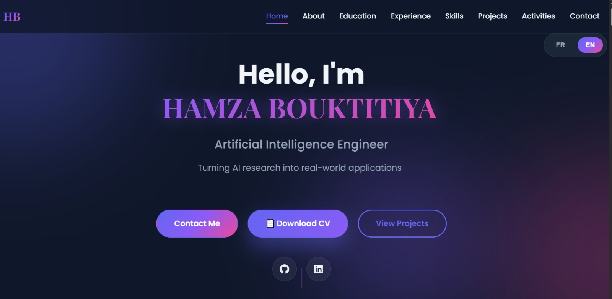

# Portfolio - Hamza Bouktitiya

🌐 **Portfolio Web Professionnel** - Ingénieur en Intelligence Artificielle

Ce portfolio présente mon parcours académique, mes expériences professionnelles, mes compétences techniques et mes projets dans le domaine de l'intelligence artificielle et du développement web.

## 🎨 Caractéristiques

- ✅ **Design Moderne & Artistique** - Interface créative avec dégradés et animations
- 🌍 **Bilingue** - Français/Anglais avec sélecteur de langue
- 📱 **Responsive** - Optimisé pour tous les appareils (mobile, tablette, desktop)
- ⚡ **Animations Fluides** - Effets de scroll, transitions et interactions
- 🎯 **Navigation Intuitive** - Menu sticky avec smooth scroll
- 🔗 **Liens Directs** - Vers GitHub, LinkedIn et projets

## 🏠 Aperçu de la Page d'Accueil



## 📂 Structure du Projet

```
portfolio/
│
├── index.html          # Page principale HTML
├── styles.css          # Styles CSS avec animations
├── script.js           # JavaScript pour interactions et langue
├── README.md           # Documentation
│
└── images/             # Dossier contenant toutes les images
    ├── profile-photo.jpg
    ├── master-image.jpeg (1-4)
    ├── Hackathon ThinkAI.jpg
    ├── Hackathon DyslexAI.jpeg
    ├── clube1.jpeg et autres images club
    └── SPORTS3.jpg
```

## 🖼️ Images à Ajouter

Pour que le portfolio soit complet, vous devez ajouter les images suivantes dans le dossier `images/` :

### Photo Principale
- **`profile-photo.jpg`** - Votre photo professionnelle (recommandé : 400x400px minimum)

### Images des Projets
- **`project-dyslexai.jpg`** - Screenshot du projet DyslexAI
- **`project-chatbot.jpg`** - Screenshot du chatbot de santé
- **`project-plate-recognition.jpg`** - Screenshot de la reconnaissance de plaques
- **`project-gym.jpg`** - Screenshot de l'application gym

### Recommandations pour les Images
- Format : JPG ou PNG
- Taille recommandée : 800x600px pour les projets
- Poids optimisé : < 500KB par image
- Utilisez des outils comme [TinyPNG](https://tinypng.com/) pour compresser

## 🚀 Déploiement sur GitHub Pages

### Méthode 1 : Dépôt Personnel (Recommandé)

1. **Créer un nouveau dépôt sur GitHub**
   - Nom du dépôt : `[votre-username].github.io`
   - Exemple : `gothamza.github.io`
   - Cochez "Public"

2. **Pousser les fichiers vers GitHub**
   ```bash
   # Si ce n'est pas déjà fait, initialisez git
   git init
   
   # Ajoutez tous les fichiers
   git add .
   
   # Faites un commit
   git commit -m "Initial commit - Portfolio website"
   
   # Ajoutez le dépôt distant
   git remote add origin https://github.com/gothamza/gothamza.github.io.git
   
   # Poussez vers GitHub
   git branch -M main
   git push -u origin main
   ```

3. **Activer GitHub Pages**
   - Allez dans les "Settings" du dépôt
   - Section "Pages"
   - Source : Sélectionnez la branche `main` et dossier `/ (root)`
   - Cliquez sur "Save"

4. **Accéder à votre site**
   - Votre site sera accessible à : `https://gothamza.github.io/`
   - Le déploiement prend 2-5 minutes

### Méthode 2 : Dépôt de Projet

1. **Créer un dépôt nommé "portfolio"**
   ```bash
   git init
   git add .
   git commit -m "Initial commit"
   git remote add origin https://github.com/gothamza/portfolio.git
   git branch -M main
   git push -u origin main
   ```

2. **Activer GitHub Pages**
   - Settings → Pages
   - Source : branche `main`, dossier `/ (root)`

3. **Accéder à votre site**
   - URL : `https://gothamza.github.io/portfolio/`

## 🔧 Personnalisation

### Modifier les Informations Personnelles

Dans **index.html**, modifiez :
- Liens sociaux (GitHub, LinkedIn)
- Email et téléphone
- Localisation
- Meta descriptions

### Changer les Couleurs

Dans **styles.css**, modifiez les variables CSS :
```css
:root {
    --primary-color: #6366f1;      /* Couleur principale */
    --secondary-color: #8b5cf6;    /* Couleur secondaire */
    --accent-color: #ec4899;       /* Couleur accent */
}
```

### Ajouter/Modifier du Contenu

- **Expériences** : Dupliquez un bloc `.experience-card` dans index.html
- **Projets** : Dupliquez un bloc `.project-card`
- **Compétences** : Ajoutez des tags dans `.skill-tags`

## 🌐 Mettre à Jour le Lien LinkedIn

⚠️ **Important** : Remplacez le lien LinkedIn par votre profil réel

Dans **index.html**, cherchez et remplacez :
```html
href="https://linkedin.com/in/hamza-bouktitiya"
```

Par votre vrai lien LinkedIn :
```html
href="https://linkedin.com/in/votre-profil-linkedin"
```

## 📱 Tests Locaux

Pour tester en local avant de déployer :

1. **Ouvrir directement le fichier HTML**
   - Double-cliquez sur `index.html`
   
2. **Utiliser un serveur local (recommandé)**
   ```bash
   # Avec Python
   python -m http.server 8000
   
   # Avec Node.js (npx)
   npx http-server
   ```
   
   Puis ouvrez : `http://localhost:8000`

## 🎯 Sections du Portfolio

1. **🏠 Accueil** - Hero section avec présentation
2. **👤 À propos** - Biographie et langues
3. **🎓 Éducation** - Parcours académique (timeline)
4. **💼 Expériences** - Stages et postes professionnels
5. **🛠️ Compétences** - Technologies et frameworks
6. **🚀 Projets** - Projets académiques avec liens GitHub
7. **🎯 Activités** - Hackathons et activités parascolaires
8. **📧 Contact** - Informations de contact

## 🔗 Liens GitHub des Projets

Vérifiez que ces liens sont corrects dans votre HTML :
- [DyslexAI Hackathon](https://github.com/HAMZAuit/dexlyxia-hackathon)
- [Health Chatbot](https://github.com/gothamza/Pixel-VisionV2)
- [License Plate Recognition](https://github.com/gothamza/UK_PLATES_DETECTION)
- [Gym Website](https://github.com/gothamza/gym_website_s6)
- [Multi-dept AI Assistant](https://github.com/gothamza/multidept-ai-assistant)

## 📝 TODO Après le Déploiement

- [ ] Ajouter vos vraies images (photo + projets)
- [ ] Mettre à jour le lien LinkedIn
- [ ] Tester sur mobile et tablette
- [ ] Partager le lien sur vos réseaux sociaux
- [ ] Ajouter le lien du portfolio dans votre CV
- [ ] Mettre le lien dans votre bio GitHub

## 🛠️ Technologies Utilisées

- **HTML5** - Structure sémantique
- **CSS3** - Styles modernes avec animations
- **JavaScript (Vanilla)** - Interactions et sélecteur de langue
- **Font Awesome** - Icônes
- **Google Fonts** - Typographies (Poppins, Playfair Display)

## 📧 Contact

**Hamza Bouktitiya**
- 📧 Email: bouktitiya.hamza.post@gmail.com
- 💼 LinkedIn: [À mettre à jour]
- 🐙 GitHub: [@gothamza](https://github.com/gothamza)
- 📍 Localisation: Kenitra, Maroc

## 📄 Licence

© 2025 Hamza Bouktitiya. Tous droits réservés.

---

**Conçu avec ❤️ et passion pour l'IA**

