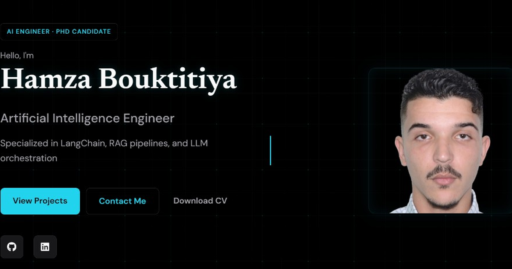
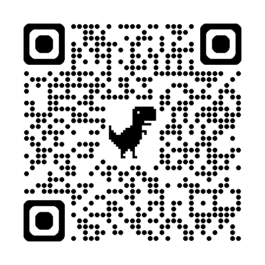

# Portfolio - Hamza Bouktitiya

🌐 **Professional Web Portfolio** - Artificial Intelligence Engineer

This portfolio showcases my academic background, professional experiences, technical skills, and projects in the field of artificial intelligence and web development.

## 🎨 Features

- ✅ **Modern & Artistic Design** - Creative interface with gradients and animations
- 🌍 **Bilingual** - French/English with language selector
- 📱 **Responsive** - Optimized for all devices (mobile, tablet, desktop)
- ⚡ **Smooth Animations** - Scroll effects, transitions and interactions
- 🎯 **Intuitive Navigation** - Sticky menu with smooth scrolling
- 🔗 **Direct Links** - To GitHub, LinkedIn and projects

## 🏠 Preview



**Live site:** [gothamza.github.io/portfolio](https://gothamza.github.io/portfolio/)

### QR code

Scan to open the portfolio on your phone:



## 📂 Project Structure

```
portfolio/
├── index.html              # Live site (must stay at repo root for GitHub Pages)
├── css/
│   └── styles-studio.css   # Studio HUD styles
├── js/
│   └── script-studio.js    # Interactions, i18n, canvas
├── images/                 # Photos, icons, OG preview
├── PDFs/                   # Downloadable CVs & demos
├── docs/                   # Guides (deploy, design, images…)
├── cv-source/              # LaTeX CV sources
├── legacy/                 # Old alternate pages (not deployed as main)
├── README.md
└── README.fr.md
```

GitHub Pages serves from the repo root. Relative paths like `css/styles-studio.css` and `js/script-studio.js` work the same as root files — no problem.

## 🖼️ Images to Add

To complete your portfolio, add the following images to the `images/` folder:

### Profile Photo
- **`profile-photo.jpg`** - Your professional photo (recommended: minimum 400x400px)

### Project Images
- **`project-dyslexai.jpg`** - DyslexAI project screenshot
- **`project-chatbot.jpg`** - Health chatbot screenshot
- **`project-plate-recognition.jpg`** - License plate recognition screenshot
- **`project-gym.jpg`** - Gym application screenshot

### Image Recommendations
- Format: JPG or PNG
- Recommended size: 800x600px for projects
- Optimized weight: < 500KB per image
- Use tools like [TinyPNG](https://tinypng.com/) to compress

## 🚀 Deployment on GitHub Pages

### Method 1: Personal Repository (Recommended)

1. **Create a new repository on GitHub**
   - Repository name: `[your-username].github.io`
   - Example: `gothamza.github.io`
   - Check "Public"

2. **Push files to GitHub**
   ```bash
   # If not already done, initialize git
   git init
   
   # Add all files
   git add .
   
   # Make a commit
   git commit -m "Initial commit - Portfolio website"
   
   # Add remote repository
   git remote add origin https://github.com/gothamza/gothamza.github.io.git
   
   # Push to GitHub
   git branch -M main
   git push -u origin main
   ```

3. **Enable GitHub Pages**
   - Go to repository "Settings"
   - Section "Pages"
   - Source: Select branch `main` and folder `/ (root)`
   - Click "Save"

4. **Access your site**
   - Your site will be accessible at: `https://gothamza.github.io/`
   - Deployment takes 2-5 minutes

### Method 2: Project Repository

1. **Create a repository named "portfolio"**
   ```bash
   git init
   git add .
   git commit -m "Initial commit"
   git remote add origin https://github.com/gothamza/portfolio.git
   git branch -M main
   git push -u origin main
   ```

2. **Enable GitHub Pages**
   - Settings → Pages
   - Source: branch `main`, folder `/ (root)`

3. **Access your site**
   - URL: `https://gothamza.github.io/portfolio/`

## 🔧 Personnalisation

### Modifier les Informations Personnelles

Dans **index.html**, modifiez :
- Liens sociaux (GitHub, LinkedIn)
- Email et téléphone
- Localisation
- Meta descriptions

### Changer les Couleurs

Dans **styles.css**, modifiez les variables CSS :
```css
:root {
    --primary-color: #6366f1;      /* Couleur principale */
    --secondary-color: #8b5cf6;    /* Couleur secondaire */
    --accent-color: #ec4899;       /* Couleur accent */
}
```

### Ajouter/Modifier du Contenu

- **Expériences** : Dupliquez un bloc `.experience-card` dans index.html
- **Projets** : Dupliquez un bloc `.project-card`
- **Compétences** : Ajoutez des tags dans `.skill-tags`

## 🌐 Mettre à Jour le Lien LinkedIn

⚠️ **Important** : Remplacez le lien LinkedIn par votre profil réel

Dans **index.html**, cherchez et remplacez :
```html
href="https://linkedin.com/in/hamza-bouktitiya"
```

Par votre vrai lien LinkedIn :
```html
href="https://linkedin.com/in/votre-profil-linkedin"
```

## 📱 Local Testing

To test locally before deploying:

1. **Open HTML file directly**
   - Double-click on `index.html`
   
2. **Use a local server (recommended)**
   ```bash
   # With Python
   python -m http.server 8000
   
   # With Node.js (npx)
   npx http-server
   ```
   
   Then open: `http://localhost:8000`

## 🎯 Portfolio Sections

1. **🏠 Home** - Hero section with introduction
2. **👤 About** - Biography and languages
3. **🎓 Education** - Academic background (timeline)
4. **💼 Experience** - Internships and professional positions
5. **🛠️ Skills** - Technologies and frameworks
6. **🚀 Projects** - Academic projects with GitHub links
7. **🎯 Activities** - Hackathons and extracurricular activities
8. **📧 Contact** - Contact information

## 🔗 Project GitHub Links

Verify these links are correct in your HTML:
- [DyslexAI Hackathon](https://github.com/HAMZAuit/dexlyxia-hackathon)
- [Health Chatbot](https://github.com/gothamza/Pixel-VisionV2)
- [License Plate Recognition](https://github.com/gothamza/UK_PLATES_DETECTION)
- [Gym Website](https://github.com/gothamza/gym_website_s6)
- [Multi-dept AI Assistant](https://github.com/gothamza/multidept-ai-assistant)

## 📝 TODO After Deployment

- [ ] Add your actual images (photo + projects)
- [ ] Update LinkedIn link
- [ ] Test on mobile and tablet
- [ ] Share the link on your social media
- [ ] Add portfolio link to your CV
- [ ] Put the link in your GitHub bio

## 🛠️ Technologies Used

- **HTML5** - Semantic structure
- **CSS3** - Modern styles with animations
- **JavaScript (Vanilla)** - Interactions and language selector
- **Font Awesome** - Icons
- **Google Fonts** - Typography (Poppins, Playfair Display)

## 📧 Contact

**Hamza Bouktitiya**
- 📧 Email: bouktitiya.hamza.post@gmail.com
- 💼 LinkedIn: [To be updated]
- 🐙 GitHub: [@gothamza](https://github.com/gothamza)
- 📍 Location: Kenitra, Morocco

## 📄 License

© 2025 Hamza Bouktitiya. All rights reserved.

---

**Designed with ❤️ and passion for AI**

---

## 🇫🇷 Version Française

Pour la version française complète, consultez [README.fr.md](README.fr.md)

